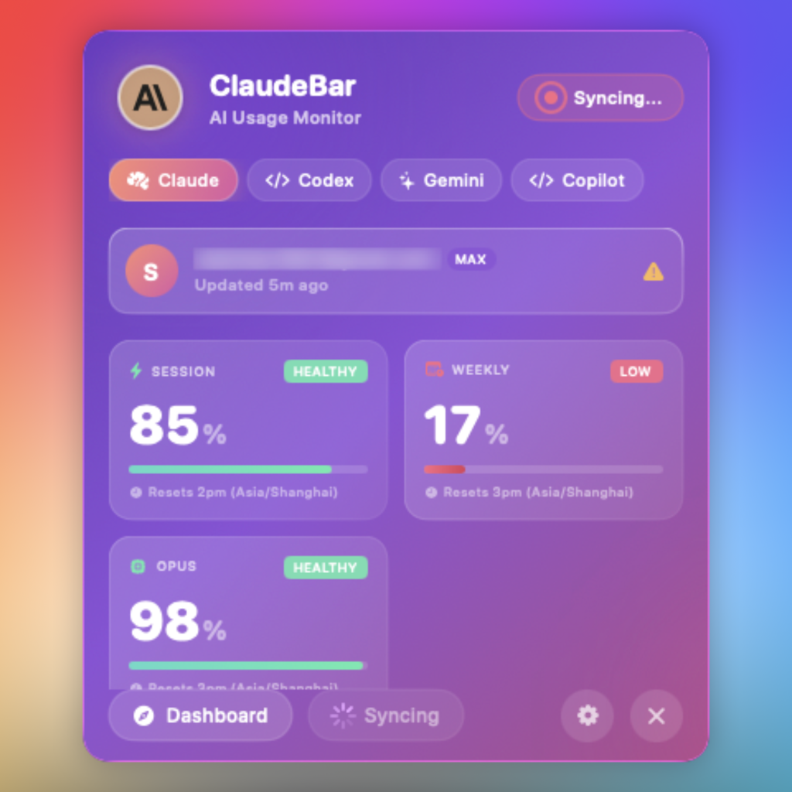
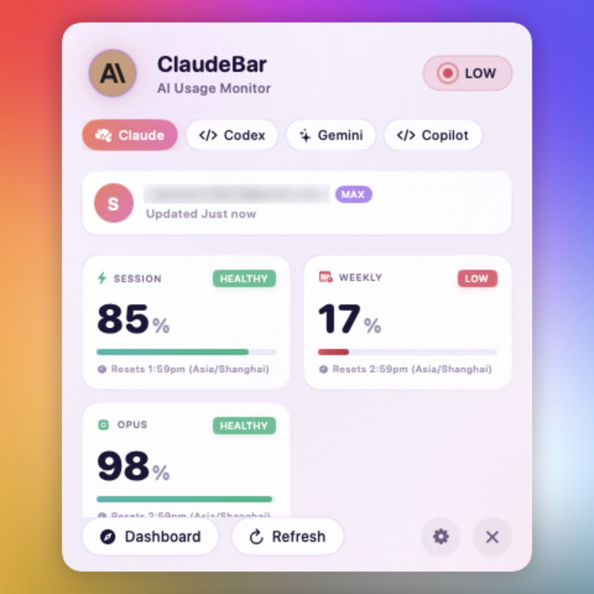
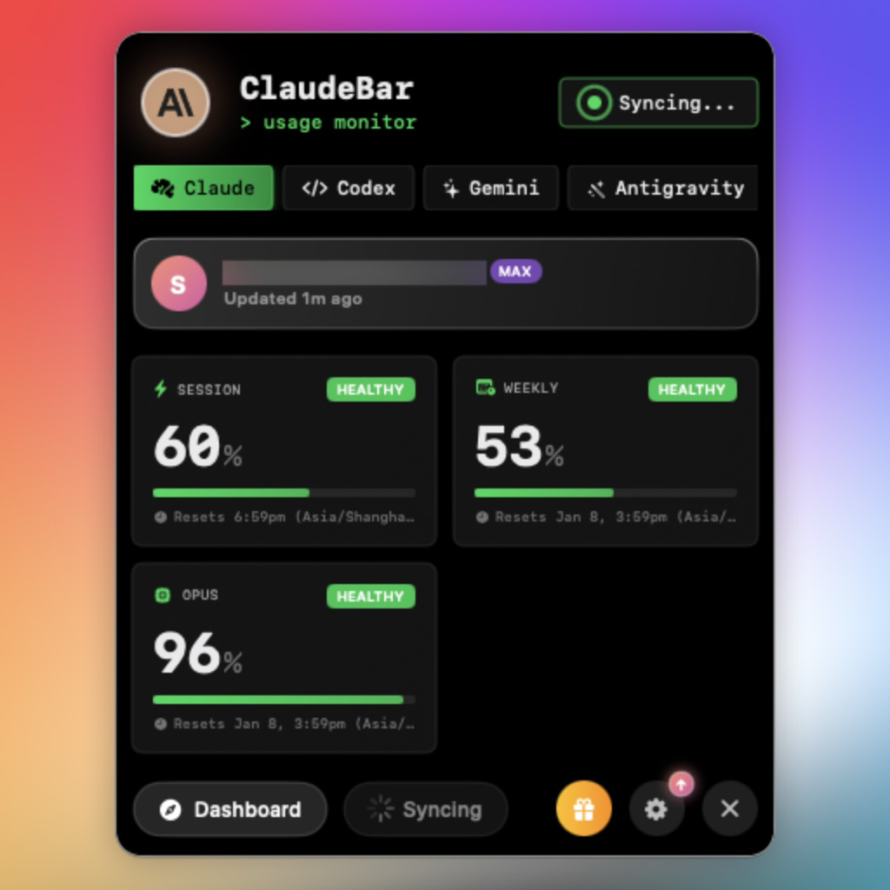
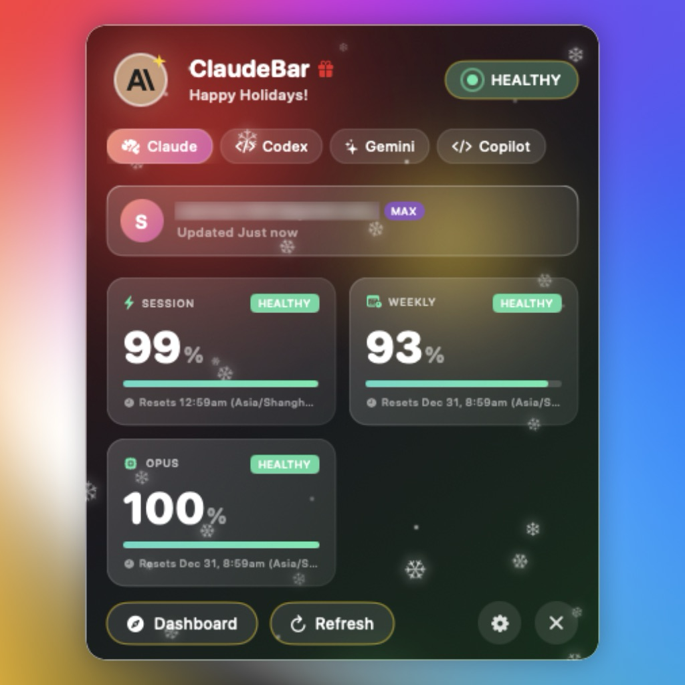
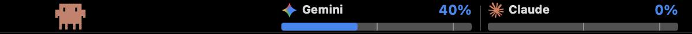
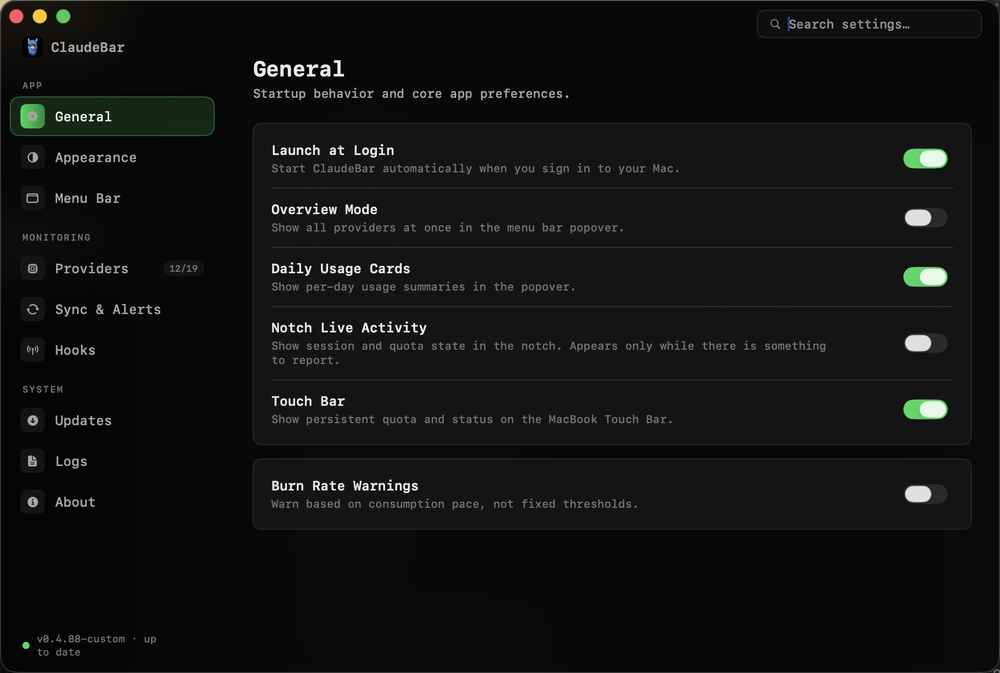

# ClaudeBar (with Touch Bar)

[](https://github.com/tddworks/ClaudeBar/actions/workflows/build.yml)
[](https://github.com/tddworks/ClaudeBar/actions/workflows/tests.yml)
[](https://codecov.io/gh/tddworks/ClaudeBar)
[](https://github.com/tddworks/ClaudeBar/releases/latest)
[](https://swift.org)
[](https://developer.apple.com)
[](https://formulae.brew.sh/cask/claudebar)

A macOS menu bar application that monitors AI coding assistant usage quotas in real time. Keep track of your Claude, OpenAI Codex, Google Gemini, GitHub Copilot, Google Antigravity, Cursor, AWS Bedrock, AWS Kiro, Kimi, DeepSeek, Mistral, MiniMax, Alibaba Coding Plan, Z.ai, Amp Code, OpenCode Go, Oh My Pi, Grok Build, and Vercel at a glance.

Featuring full **MacBook Touch Bar integration** with persistent multi-provider gauges and an interactive pixel mascot (**Clawd**), **MacBook Notch Live Activity**, **Multi-Account Switching**, and Raycast-style **User Extensions**.

<table align="center">
  <tr>
    <td align="center"><br/><em>Dark Mode</em></td>
    <td align="center"><br/><em>Light Mode</em></td>
  </tr>
  <tr>
    <td align="center"><br/><em>CLI Theme</em></td>
    <td align="center"><br/><em>Christmas Theme</em></td>
  </tr>
</table>

## Sponsors

Some companies support ClaudeBar's open source development through [GitHub Sponsors](https://github.com/sponsors/hanrw). We'd like to give a special mention to the following sponsors:

<table>
  <tbody>
    <tr>
      <td width="30%" align="center">
        <a href="https://www.testmuai.com/?utm_source=ClaudeBar&utm_medium=opensourcecollab" target="_blank">
          <picture>
            <source media="(prefers-color-scheme: dark)" srcset="docs/sponsors/testmuai/testmuai-dark.svg"/>
            
          </picture>
        </a>
      </td>
      <td><a href="https://www.testmuai.com/?utm_source=ClaudeBar&utm_medium=opensourcecollab">TestMu AI</a> (formerly LambdaTest) is the world's first full-stack agentic AI quality engineering platform, trusted by 18,000+ enterprises.</td>
    </tr>
  </tbody>
</table>

> **Editorial independence:** Sponsorship does not influence which providers ClaudeBar supports, how they are ordered in the app, or how their quota data is reported.

## Features

- **Multi-Provider Support** - Monitor Claude, Codex, Gemini, GitHub Copilot, Antigravity, Z.ai, Kimi, Kiro, Amp, OpenCode Go, Oh My Pi, and Grok quotas in one place
- **Provider Enable/Disable** - Toggle individual providers on/off from Settings to customize your monitoring
- **Real-Time Quota Tracking** - View Session, Weekly, and Model-specific usage percentages
- **Multiple Themes** - Light, Dark, CLI, Christmas, and [imported terminal themes](#import-terminal-theme) (.itermcolors)
- **Automatic Adaptation** - System theme follows your macOS appearance; Christmas auto-enables during the holiday season
- **Visual Status Indicators** - Color-coded progress bars (green/yellow/red) show quota health
- **System Notifications** - Get alerted when quota status changes to warning or critical
- **Touch Bar Integration** - Persistent MacBook Touch Bar widget with real-time multi-provider gauges, progress bars, and an interactive pixel mascot ([learn more](#claudebar-with-touch-bar))
- **Notify! Lock Screen Publishing** - Push quota state to your iPhone Lock Screen via [Notify!](https://getnotifyapp.com) as a Live Activity showing up to six quota windows plus a widget gauge for one chosen quota (off by default, see below)
- **Auto-Refresh** - Automatically updates quotas at configurable intervals
- **Keyboard Shortcuts** - Quick access with `⌘D` (Dashboard) and `⌘R` (Refresh)

## Quota Status Thresholds

| Remaining | Status | Color | Description |
|-----------|--------|-------|-------------|
| > 50% | Healthy | Blue / Green | Ample quota available |
| 20-50% | Warning | Yellow / Amber | Approaching usage threshold or accelerated burn rate |
| < 20% | Critical | Red | Low quota remaining; alerts triggered |
| 0% | Depleted | Gray | Quota exhausted; Clawd mascot enters sleep mode |

> [!TIP]
> You can also enable **Burn Rate Warnings** in **Settings > General** to trigger alerts based on your real-time consumption velocity against remaining time rather than fixed percentage cutoffs.

## ClaudeBar with Touch Bar

ClaudeBar features native, system-wide Touch Bar integration for MacBook Pro models equipped with an Apple Touch Bar (including M1/M2 and Intel). Inspired by [`tpklo/claude-usage-touchbar`](https://github.com/tpklo/claude-usage-touchbar), this runs 100% natively inside ClaudeBar—requiring **zero third-party apps** (no BetterTouchTool or MTMR required).

<p align="center">
  
</p>

### Key Touch Bar Features

- **Always Visible System-Wide (`placement: 0`)**: Uses macOS system-modal function bar presentation. The widget remains persistently visible across all full-screen windows and apps, automatically re-asserting on app switching and system unlock while keeping your system Escape key and Control Strip media/volume controls intact.
- **Interactive Pixel Mascot (Clawd)**:
  - An animated 20×20 retro creature pacing along an illuminated ground line.
  - **Mood-Reactive Gauge**: Clawd adapts his speed, expression, and behavior to your highest quota usage:
    - **Calm** (< 30%): A relaxed stroll at 12 pt/s.
    - **Brisk** (30%–59%): An upbeat walk at 24 pt/s.
    - **Tired** (60%–84%): Sluggish pace at 8 pt/s with drooping eyes and animated sweat drops.
    - **Panic** (85%–99%): Frantic scurrying at 48 pt/s with wide eyes and trailing motion streaks.
    - **Sleeping** (100% / Depleted): Stops walking peacefully in place, eyes close to horizontal bars `— —`, and `zzz` bubbles float upward.
  - **Active Patrol Behavior**: Clawd stays awake and continuously patrols the Touch Bar as long as quota is under 100%.
  - **Global Keyboard Activity Monitor**: Typing on your Mac keyboard wakes Clawd up or keeps him energized while you code.
  - **Dynamic Provider Body Tints**: Clawd's body takes on the active provider's brand color (Claude terracotta, Gemini amber, Copilot indigo, Antigravity violet, Codex teal, Cursor cyan, DeepSeek cobalt, Kimi sky blue, etc.) with sRGB color safety, gently dimming during sleep.
  - **Event-Driven Reactions & Particles**:
    - **Status Degrades**: Body flashes white for 0.12s + an `!` particle floats upward.
    - **Quota Resets / Drops < 100%**: Burst of `✦` sparkle particles and Clawd immediately wakes up.
    - **Provider Switches**: Clawd jumps upward in an arc (85 pt) and flips direction to face the new provider.
    - **Refresh Triggered**: A spinning `?` particle orbits his head for 1.5s.
  - **Context-Aware Animations**:
    - **Active Claude Code Session**: Speed multiplied ×1.5 (session sprint) + glowing orange ring beneath feet.
    - **Night Mode (22:00–04:59)**: Speed reduced ×0.6 + drifting star particles.
    - **Christmas Theme**: Red pixel Santa hat with white brim and pompom.
  - **Direct Touch Interaction & Physics**: Tap to jump, touch and drag Clawd anywhere on the bar, or flick him with realistic velocity and friction decay (`0.92` damping). Built-in boundary intelligence ensures Clawd turns around smoothly before reaching the quota progress bars.
- **Live Multi-Provider Quota Gauges**:
  - Displays authentic provider logos (Claude, Gemini, Antigravity, GitHub Copilot, Codex, etc.).
  - Multi-segment provider views matching your menu bar configuration (e.g. `[Logo] Gemini 40% | [Logo] Claude 0%`).
  - High-precision bold monospaced percentage readout with warning indicator (`!`) when quota is critical (≥ 90%).
  - Sleek progress bars with 100% track reference, adaptive color coding, and scale tick marks at **50%** and **90%**.
  - Reset countdown timer (e.g., `2:15`, `35m`, `3d`).
- **One-Tap Access**: Tap anywhere on the quota gauges on the Touch Bar to instantly summon the full ClaudeBar dropdown popover (`claudebar://open`).
- **External Integrations**: Exports real-time status to `~/.claudebar/status.json` for users who prefer embedding widgets in BetterTouchTool or MTMR using `scripts/touchbar_status.py`.

> [!TIP]
> For detailed setup instructions, MTMR/BTT configurations, and customization details, see the [Full Touch Bar Guide](docs/touchbar/TOUCHBAR_GUIDE.md).

### Enabling or Disabling Touch Bar

You can toggle the persistent Touch Bar on or off at any time from **Settings > General > Touch Bar**:

<p align="center">
  
</p>

## MacBook Notch Live Activity

ClaudeBar can render Claude Code's session and quota state directly in your MacBook notch (Settings > General > Notch Live Activity):

- **Idle Mode**: Displays your selected provider's most depleted quota at a glance.
- **Active Session Mode**: Displays repository name, elapsed time, and the number of active subagents fanned out.
- **Permission Alert**: Prominently highlights when Claude Code is waiting for permission in terminal.
- **Hover Popover**: Hovering expands the notch into a full status view with active session list, quota cards, and quick action buttons.
- **Virtual Notch**: Displays without a physical notch (or external monitors) automatically receive an elegant virtual notch sized to the menu bar.

> [!NOTE]
> Read the complete documentation at [docs/features/notch-live-activity.md](docs/features/notch-live-activity.md).

## Requirements

- macOS 15+
- Swift 6.2+
- Providers and CLI tools you wish to monitor:
  - [Claude](https://claude.ai/code) - CLI mode (`claude`) or direct OAuth API mode
  - [Codex](https://github.com/openai/codex) - CLI RPC mode (`codex`) or ChatGPT backend API mode
  - [Gemini](https://github.com/google-gemini/gemini-cli) - `gemini` CLI
  - [GitHub Copilot](https://github.com/features/copilot) - Billing API or Internal Copilot API mode
  - [Antigravity](https://antigravity.google) - Auto-detected when running locally
  - [Cursor](https://cursor.com) - Auto-detected via local SQLite DB and usage API
  - [AWS Bedrock](https://aws.amazon.com/bedrock/) - AWS SSO profile or IAM credentials
  - [AWS Kiro](https://kiro.dev) - `kiro-cli` via `uv tool install kiro-cli`
  - [Kimi](https://www.kimi.com/code/console) - `kimi` CLI mode (recommended) or API cookie mode
  - [DeepSeek](https://www.deepseek.com) - API key configured in Settings
  - [Mistral](https://mistral.ai) - Backed by Vibe session logs
  - [MiniMax](https://www.minimax.io) - Coding Plan API key (International / China)
  - [Alibaba Coding Plan](https://bailian.console.aliyun.com) - Model Studio API key or browser cookie
  - [Z.ai](https://z.ai/subscribe) - Configure Claude Code with GLM Coding Plan endpoint
  - [Amp Code](https://ampcode.com) - Auto-detected when `amp` CLI is installed
  - [OpenCode Go](https://opencode.ai/go) - Local SQLite DB or Zen API key
  - [Oh My Pi](https://omp.sh) - Aggregates account usage via `omp usage --json`
  - [Grok Build](https://docs.x.ai) - Tracks xAI credits using CLI OAuth credentials
  - [Vercel](https://vercel.com) - Token-based quota tracking
  - [Custom Extensions](docs/features/extensions.md) - Drop custom scripts into `~/.claudebar/extensions/`

### Provider Setup Guides

<details>
<summary><strong>Kimi Setup</strong></summary>

Kimi supports two probe modes, configurable in **Settings > Kimi Configuration**:
- **CLI Mode (Recommended)**: Launches interactive `kimi` and executes `/usage`. Requires `uv tool install kimi-cli` or `pip install kimi-cli`. No Full Disk Access required.
- **API Mode**: Calls Kimi Connect-RPC directly using browser cookie auth. Requires **Full Disk Access** for ClaudeBar in **System Settings > Privacy & Security > Full Disk Access** (or set `KIMI_AUTH_TOKEN`).
</details>

<details>
<summary><strong>AWS Kiro Setup</strong></summary>

Kiro monitors AWS Kiro (formerly CodeWhisperer) usage via `kiro-cli`.
- **Install**: `uv tool install kiro-cli` or `pip install kiro-cli`
- **Authenticate**: Run `kiro-cli` and complete the login prompt (or use Kiro IDE).
</details>

<details>
<summary><strong>AWS Bedrock Setup</strong></summary>

Monitors daily spend, token counts, and per-model breakdowns via CloudWatch.
- Configure AWS SSO profile or environment variables in **Settings > Bedrock**.
- Select target inference regions (e.g. `us-east-1`, `us-west-2`).
</details>

<details>
<summary><strong>Alibaba Coding Plan Setup</strong></summary>

Monitors 5-hour session, weekly, and monthly quotas on Alibaba Model Studio / Bailian.
- Choose region: International (`modelstudio.console.alibabacloud.com`) or China Mainland (`bailian.console.aliyun.com`).
- Authenticate via API key or browser cookie extraction.
</details>

<details>
<summary><strong>Cursor Setup</strong></summary>

Automatically detects your active Cursor IDE installation and reads authentication tokens from Cursor's local SQLite database. Displays included requests and on-demand spend.
</details>

## URL Schemes

ClaudeBar supports the `claudebar://` URL scheme for quick actions from Raycast, Alfred, Touch Bar widgets, or terminal:

| URL Scheme | Action | CLI Example |
|---|---|---|
| `claudebar://open` | Toggles the ClaudeBar dropdown popover | `open claudebar://open` |
| `claudebar://refresh` | Triggers immediate quota refresh for all providers | `open claudebar://refresh` |
| `claudebar://settings` | Opens the ClaudeBar Settings window | `open claudebar://settings` |

### Notify! Setup

Publishing quota state to your iPhone Lock Screen is optional and off by default. It is configured in **Settings > Notify!**.

1. Get [Notify!](https://getnotifyapp.com). It runs on Mac, on iOS, and on any device through web push.
2. **Open it once on the iPhone or iPad you want to publish to.** A Live Activity cannot be started until that device has registered with the push service, and only opening the app does that.
3. In Notify!, copy your device ID and device token.
4. Put them in the **Device ID** and **Token** fields in ClaudeBar's Notify! settings pane and press **Save Link**. Pasting a whole notification URL into the Device ID field works too, ClaudeBar splits it across both. **Verify Device** confirms the pair against Notify! and names the phone it belongs to. Then turn **Publish to Notify!** on.

The Live Activity needs an iPhone or iPad ID. Notify! also issues IDs for Macs and browsers, and those keep the widget gauge perfectly well, but Notify! cannot start a Live Activity on one, so ClaudeBar disables just that switch and says why. A group ID receives notifications but owns no Lock Screen of its own, so it gets neither.

The Live Activity and the widget gauge can each be turned off separately, and you can choose which quota the gauge shows. Note that this sends provider names, quota window labels and remaining percentages to a third-party service. The device token is stored in the Keychain, not in `~/.claudebar/settings.json`. A build you compile yourself is ad-hoc signed and the Keychain refuses it, so on those the token falls back to ClaudeBar's app credentials and the pane says so.

Full details: [docs/features/notify.md](docs/features/notify.md).

## Installation

### Homebrew

Install via [Homebrew](https://brew.sh):

```bash
brew install --cask claudebar
```

### Download (Recommended)

Download the latest release from [GitHub Releases](https://github.com/tddworks/ClaudeBar/releases/latest):

- **DMG**: Open and drag ClaudeBar.app to Applications
- **ZIP**: Unzip and move ClaudeBar.app to Applications

Both are code-signed and notarized for Gatekeeper.

### Build from Source

```bash
git clone https://github.com/tddworks/ClaudeBar.git
cd ClaudeBar

# Install Tuist (if not installed)
brew install tuist

# Install dependencies and build
tuist install
tuist build ClaudeBar -C Release
```

## Usage

After building, open the generated Xcode workspace and run the app:

```bash
tuist generate
open ClaudeBar.xcworkspace
```

Then press `Cmd+R` in Xcode to run. The app will appear in your menu bar. Click to view quota details for each provider.

## Development

The project uses [Tuist](https://tuist.io) for dependency management and Xcode project generation.

### Quick Start

```bash
# Install Tuist (if not installed)
brew install tuist

# Install dependencies
tuist install

# Generate Xcode project and open
tuist generate
open ClaudeBar.xcworkspace
```

### Build & Test

```bash
# Build the project
tuist build

# Run all tests
tuist test

# Run tests with coverage
tuist test --result-bundle-path TestResults.xcresult -- -enableCodeCoverage YES

# Build release configuration
tuist build ClaudeBar -C Release
```

### SwiftUI Previews

After opening in Xcode, SwiftUI previews will work with `Cmd+Option+Return`. The project is configured with `ENABLE_DEBUG_DYLIB` for preview support.

## Architecture

> **Full documentation:** [docs/architecture/ARCHITECTURE.md](docs/architecture/ARCHITECTURE.md)

ClaudeBar uses a **layered architecture** with `QuotaMonitor` as the single source of truth:

| Layer | Purpose |
|-------|---------|
| **App** | SwiftUI views consuming domain directly (no ViewModel) |
| **Domain** | Rich models, `QuotaMonitor`, repository protocols |
| **Infrastructure** | Probes, storage implementations, adapters, drivers |

### Key Design Decisions

- **Single Source of Truth** - `QuotaMonitor` owns all provider state
- **Repository Pattern** - Settings and credentials abstracted behind injectable protocols (`JSONSettingsRepository`)
- **Protocol-Based DI** - `@Mockable` protocols enable testability
- **Chicago School TDD** - Tests verify state changes, not method calls
- **No ViewModel/AppState** - Views consume domain directly

## Import Terminal Theme

Match ClaudeBar's appearance to your terminal. Import any `.itermcolors` file:

1. Open **Settings** (gear icon)
2. Click **Import .itermcolors**
3. Select your file (export from iTerm2: Preferences > Profiles > Colors > Color Presets > Export)

450+ pre-made schemes available at [iTerm2-Color-Schemes](https://github.com/mbadolato/iTerm2-Color-Schemes/tree/master/schemes).

Imported themes are saved in `~/.claudebar/themes/` and persist across restarts.

## User Extensions

Create your own provider monitoring modules by dropping a manifest and script into `~/.claudebar/extensions/`. Extensions can define quota grids, daily usage cards, and automated HTTP health checks.

See [docs/features/extensions.md](docs/features/extensions.md) for full specification and example implementations.

## Contributing

### Adding a New AI Provider

Use the **add-provider** skill to guide you through adding new providers with TDD:

```
Tell Claude Code: "I want to add a new provider for [ProviderName]"
```

The skill guides you through: Parsing Tests → Probe Tests → Implementation → Registration.

See `.claude/skills/add-provider/SKILL.md` for details and `AntigravityUsageProbe` as a reference implementation.

## Dependencies

- [Sparkle](https://sparkle-project.org/) - Auto-update framework
- [Mockable](https://github.com/Kolos65/Mockable) - Protocol mocking for tests
- [Tuist](https://tuist.io) - Xcode project generation (for SwiftUI previews)

## Releasing

Releases are automated via GitHub Actions. Push a version tag to create a new release.

**For detailed setup instructions, see [docs/release/RELEASE_SETUP.md](docs/release/RELEASE_SETUP.md).**

### Release Workflow

The workflow uses Tuist to generate the Xcode project:

```
Tag v1.0.0 → Update Info.plist → tuist generate → xcodebuild → Sign & Notarize → GitHub Release
```

Version is set in `Sources/App/Info.plist` and flows through to Sparkle auto-updates.

### Quick Start

1. **Configure GitHub Secrets** (see [full guide](docs/release/RELEASE_SETUP.md)):

   | Secret | Description |
   |--------|-------------|
   | `APPLE_CERTIFICATE_P12` | Developer ID certificate (base64) |
   | `APPLE_CERTIFICATE_PASSWORD` | Password for .p12 |
   | `APP_STORE_CONNECT_API_KEY_P8` | API key (base64) |
   | `APP_STORE_CONNECT_KEY_ID` | Key ID |
   | `APP_STORE_CONNECT_ISSUER_ID` | Issuer ID |

2. **Verify your certificate**:
   ```bash
   ./scripts/verify-p12.sh /path/to/certificate.p12
   ```

3. **Create a release**:
   ```bash
   git tag v1.0.0
   git push origin v1.0.0
   ```

The workflow will automatically build, sign, notarize, and publish to GitHub Releases.

## Contributors

Thanks goes to these wonderful people ([emoji key](https://allcontributors.org/docs/en/emoji-key)):

<!-- ALL-CONTRIBUTORS-LIST:START - Do not remove or modify this section -->
<!-- prettier-ignore-start -->
<!-- markdownlint-disable -->
<table>
  <tbody>
    <tr>
      <td align="center" valign="top" width="16.66%"><a href="https://tddworks.com/"><br /><sub><b>itshan</b></sub></a><br /><a href="https://github.com/tddworks/claudebar/commits?author=hanrw" title="Code">💻</a> <a href="https://github.com/tddworks/claudebar/commits?author=hanrw" title="Documentation">📖</a> <a href="#maintenance-hanrw" title="Maintenance">🚧</a></td>
      <td align="center" valign="top" width="16.66%"><a href="https://github.com/avishj"><br /><sub><b>Avish Jha</b></sub></a><br /><a href="https://github.com/tddworks/claudebar/commits?author=avishj" title="Code">💻</a></td>
      <td align="center" valign="top" width="16.66%"><a href="https://github.com/ramarivera"><br /><sub><b>Ramiro</b></sub></a><br /><a href="https://github.com/tddworks/claudebar/commits?author=ramarivera" title="Code">💻</a></td>
      <td align="center" valign="top" width="16.66%"><a href="https://github.com/LunarECL"><br /><sub><b>LunarECL</b></sub></a><br /><a href="https://github.com/tddworks/claudebar/commits?author=LunarECL" title="Code">💻</a></td>
      <td align="center" valign="top" width="16.66%"><a href="https://github.com/zenibako"><br /><sub><b>Chandler Anderson</b></sub></a><br /><a href="https://github.com/tddworks/claudebar/commits?author=zenibako" title="Code">💻</a></td>
      <td align="center" valign="top" width="16.66%"><a href="https://frmr.me"><br /><sub><b>Matt Farmer</b></sub></a><br /><a href="https://github.com/tddworks/claudebar/commits?author=farmdawgnation" title="Code">💻</a></td>
    </tr>
    <tr>
      <td align="center" valign="top" width="16.66%"><a href="https://willner.ws"><br /><sub><b>Alex</b></sub></a><br /><a href="https://github.com/tddworks/claudebar/commits?author=AlexanderWillner" title="Code">💻</a></td>
      <td align="center" valign="top" width="16.66%"><a href="https://github.com/sailesh"><br /><sub><b>sailesh</b></sub></a><br /><a href="https://github.com/tddworks/claudebar/commits?author=sailesh" title="Code">💻</a></td>
      <td align="center" valign="top" width="16.66%"><a href="https://github.com/billyjack2"><br /><sub><b>Billy Smith</b></sub></a><br /><a href="https://github.com/tddworks/claudebar/commits?author=billyjack2" title="Code">💻</a></td>
      <td align="center" valign="top" width="16.66%"><a href="https://github.com/nero-sensei"><br /><sub><b>nero</b></sub></a><br /><a href="https://github.com/tddworks/claudebar/commits?author=nero-sensei" title="Code">💻</a></td>
      <td align="center" valign="top" width="16.66%"><a href="https://github.com/BryanQQYue"><br /><sub><b>BryanYue</b></sub></a><br /><a href="https://github.com/tddworks/claudebar/commits?author=BryanQQYue" title="Code">💻</a></td>
      <td align="center" valign="top" width="16.66%"><a href="https://blog.d0zingcat.dev/"><br /><sub><b>Tony Tang</b></sub></a><br /><a href="https://github.com/tddworks/claudebar/commits?author=d0zingcat" title="Code">💻</a></td>
    </tr>
    <tr>
      <td align="center" valign="top" width="16.66%"><a href="https://initialize.nl/"><br /><sub><b>Frank Hommers</b></sub></a><br /><a href="https://github.com/tddworks/claudebar/commits?author=frankhommers" title="Code">💻</a></td>
      <td align="center" valign="top" width="16.66%"><a href="https://www.marcusquinn.com"><br /><sub><b>Marcus Quinn</b></sub></a><br /><a href="https://github.com/tddworks/claudebar/commits?author=marcusquinn" title="Code">💻</a></td>
      <td align="center" valign="top" width="16.66%"><a href="https://github.com/hagiwaratakayuki"><br /><sub><b>hagiwara takayuki</b></sub></a><br /><a href="https://github.com/tddworks/claudebar/commits?author=hagiwaratakayuki" title="Code">💻</a></td>
      <td align="center" valign="top" width="16.66%"><a href="https://github.com/jeffscottmtl"><br /><sub><b>jeffscottmtl</b></sub></a><br /><a href="https://github.com/tddworks/claudebar/commits?author=jeffscottmtl" title="Code">💻</a></td>
      <td align="center" valign="top" width="16.66%"><a href="https://github.com/tomstetson"><br /><sub><b>Tom</b></sub></a><br /><a href="https://github.com/tddworks/claudebar/commits?author=tomstetson" title="Code">💻</a></td>
      <td align="center" valign="top" width="16.66%"><a href="https://github.com/jeffWelling"><br /><sub><b>Jeff Welling</b></sub></a><br /><a href="https://github.com/tddworks/claudebar/commits?author=jeffWelling" title="Code">💻</a></td>
    </tr>
    <tr>
      <td align="center" valign="top" width="16.66%"><a href="https://github.com/Zada5"><br /><sub><b>Zada5</b></sub></a><br /><a href="https://github.com/tddworks/claudebar/commits?author=Zada5" title="Code">💻</a></td>
      <td align="center" valign="top" width="16.66%"><a href="https://github.com/fredericoricco-debug"><br /><sub><b>fredericoricco-debug</b></sub></a><br /><a href="https://github.com/tddworks/claudebar/commits?author=fredericoricco-debug" title="Code">💻</a></td>
      <td align="center" valign="top" width="16.66%"><a href="https://lystic.dev"><br /><sub><b>Kegan Hollern</b></sub></a><br /><a href="https://github.com/tddworks/claudebar/commits?author=KeganHollern" title="Code">💻</a></td>
      <td align="center" valign="top" width="16.66%"><a href="https://github.com/jsg333"><br /><sub><b>Jeff Green</b></sub></a><br /><a href="https://github.com/tddworks/claudebar/commits?author=jsg333" title="Code">💻</a></td>
      <td align="center" valign="top" width="16.66%"><a href="https://github.com/benjaminbelaga"><br /><sub><b>Benjamin Belaga</b></sub></a><br /><a href="https://github.com/tddworks/claudebar/commits?author=benjaminbelaga" title="Code">💻</a></td>
      <td align="center" valign="top" width="16.66%"><a href="https://github.com/romanvalent"><br /><sub><b>romanvalent</b></sub></a><br /><a href="https://github.com/tddworks/claudebar/commits?author=romanvalent" title="Code">💻</a></td>
    </tr>
    <tr>
      <td align="center" valign="top" width="16.66%"><a href="http://aakshintala.com"><br /><sub><b>Amogh Akshintala</b></sub></a><br /><a href="https://github.com/tddworks/claudebar/commits?author=aakshintala" title="Code">💻</a></td>
      <td align="center" valign="top" width="16.66%"><a href="https://www.portfolio.isnakolah.me"><br /><sub><b>Daniel Nakolah</b></sub></a><br /><a href="https://github.com/tddworks/claudebar/commits?author=isnakolah" title="Code">💻</a></td>
      <td align="center" valign="top" width="16.66%"><a href="https://github.com/Mitsi-ag"><br /><sub><b>Mitsi-ag</b></sub></a><br /><a href="https://github.com/tddworks/claudebar/commits?author=Mitsi-ag" title="Code">💻</a></td>
      <td align="center" valign="top" width="16.66%"><a href="https://www.josecancinolinares.com/en/portfolio"><br /><sub><b>José Cancino Linares</b></sub></a><br /><a href="https://github.com/tddworks/claudebar/commits?author=josecancino" title="Code">💻</a></td>
      <td align="center" valign="top" width="16.66%"><a href="https://github.com/logancox"><br /><sub><b>logancox</b></sub></a><br /><a href="https://github.com/tddworks/claudebar/commits?author=logancox" title="Code">💻</a></td>
      <td align="center" valign="top" width="16.66%"><a href="http://ywmei.ca/index.php"><br /><sub><b>y5mei</b></sub></a><br /><a href="https://github.com/tddworks/claudebar/commits?author=y5mei" title="Code">💻</a></td>
    </tr>
    <tr>
      <td align="center" valign="top" width="16.66%"><a href="https://hansonkim.github.io"><br /><sub><b>Hanson Kim</b></sub></a><br /><a href="https://github.com/tddworks/claudebar/commits?author=hansonkim" title="Code">💻</a></td>
    </tr>
  </tbody>
  <tfoot>
    <tr>
      <td align="center" size="13px" colspan="6">
        
          <a href="https://all-contributors.js.org/docs/en/bot/usage">Add your contributions</a>
        </img>
      </td>
    </tr>
  </tfoot>
</table>

<!-- markdownlint-restore -->
<!-- prettier-ignore-end -->

<!-- ALL-CONTRIBUTORS-LIST:END -->
<!-- markdownlint-restore -->
<!-- prettier-ignore-end -->

This project follows the [all-contributors](https://github.com/all-contributors/all-contributors) specification. Contributions of any kind welcome!

To credit someone, comment on any issue or pull request:

```
@all-contributors please add @username for code, doc
```

## License

MIT
