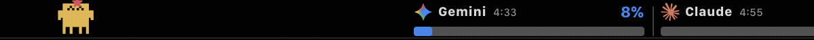

# ClaudeBar on MacBook Touch Bar

ClaudeBar features comprehensive Touch Bar integration designed specifically for MacBook Pro models equipped with an Apple Touch Bar (13-inch M1 / M2, 15 / 16-inch Intel models).

It offers two integration modes:
1. **Native Touch Bar (Primary & Recommended)**: Built directly into ClaudeBar using Swift and AppKit. Requires **zero third-party software**, operates system-wide across all applications, and includes an interactive pixel mascot alongside live quota gauges.
2. **External Integration (Optional)**: Exported status integration via `~/.claudebar/status.json` for users who prefer configuring widgets in **BetterTouchTool (BTT)** or **MTMR**.

<p align="center">
  
</p>

---

## Table of Contents

1. [Native Touch Bar (Zero Setup)](#1-native-touch-bar-zero-setup)
   - [System-Wide Persistence](#system-wide-persistence)
   - [Interactive Pixel Mascot (Clawd)](#interactive-pixel-mascot-clawd)
   - [Live Quota Gauges & Dynamic Coloring](#live-quota-gauges--dynamic-coloring)
   - [Multi-Model & Pool Intelligence (e.g. Antigravity)](#multi-model--pool-intelligence)
   - [One-Tap Interactions](#one-tap-interactions)
2. [In-App Contextual Touch Bar](#2-in-app-contextual-touch-bar)
3. [Configuration & Settings](#3-configuration--settings)
4. [External Integration: BetterTouchTool & MTMR](#4-external-integration-bettertouchtool--mtmr)
   - [Status File Architecture (`status.json`)](#status-file-architecture-statusjson)
   - [Method A: BetterTouchTool Setup](#method-a-bettertouchtool-setup)
   - [Method B: MTMR Setup](#method-b-mtmr-setup)
   - [CLI Helper Script (`touchbar_status.py`)](#cli-helper-script-touchbar_statuspy)
5. [URL Schemes](#5-url-schemes)
6. [Troubleshooting](#6-troubleshooting)

---

## 1. Native Touch Bar (Zero Setup)

The native Touch Bar driver (`PersistentTouchBarDriver`) runs completely inside the ClaudeBar app process with no dependencies on external tools.

### System-Wide Persistence

- **Modal Function Bar Presentation (`placement: 0`)**: ClaudeBar presents its Touch Bar interface at the macOS system-modal level. This keeps the widget visible at all times, regardless of which application or full-screen space is active.
- **Automatic Lifecycle Re-Assertion**: Automatically re-asserts itself when you switch applications (`NSWorkspace.didActivateApplicationNotification`) or unlock your Mac screen (`com.apple.screenIsUnlocked`).
- **Preserves System Controls**: Intelligently suppresses intrusive dismiss/close buttons (`DFRSystemModalShowsCloseBoxWhenFrontMost(false)`) and uses an empty Escape replacement item, leaving your system Control Strip (volume, brightness, media controls) and Escape key completely functional.

---

### Interactive Pixel Mascot (Clawd)

On the left side of the Touch Bar, ClaudeBar displays **Clawd**, an animated 20×20 retro pixel mascot pacing along an illuminated ground line.

#### Mood-Reactive Behavior
Clawd automatically reflects your highest quota consumption and the overall quota status across all active gauges:

| Mood | Trigger | Speed | Body Color | Eyes | Visuals |
|---|---|---|---|---|---|
| **Calm** | Usage < 30% | 12 pt/s | Terracotta + provider tint | Normal dots | Relaxed stroll |
| **Brisk** | Usage 30–59% | 24 pt/s | Terracotta + provider tint | Normal dots | Upbeat walk |
| **Tired** | Usage 60–84% | 8 pt/s | Terracotta + provider tint | Drooping (row lower) | Sluggish, animated blue sweat drop |
| **Panic** | Usage 85–99% | 48 pt/s | Alert red tint | Wide, spread apart | Frantic scurry + trailing motion streaks |
| **Sleeping** | Usage = 100% (Depleted) | 0 pt/s | Dimmed terracotta + provider tint | Flat bars `— —` | Sleeps peacefully in place, `zzz` bubbles float upward |

#### Expression System
Clawd's eyes change shape based on mood — each state uses a distinct pixel pattern drawn directly onto the 20×20 sprite grid:
- **Calm / Brisk**: Single dot per eye (standard)
- **Tired**: Drooping dots — shifted one row lower
- **Panic**: Two-pixel wide eyes set further apart
- **Sleeping (100% Quota / Depleted)**: Flat horizontal closed bars `—— ——`

#### Provider Body Color
Clawd's body shifts color (100% provider brand color) to reflect which AI provider is currently active. When Clawd enters the **Sleeping** state at 100% quota, this provider color is gently dimmed (82% brightness) to convey rest while preserving provider identity:

| Provider | Color |
|---|---|
| Claude | Base terracotta |
| Gemini | Golden amber |
| Copilot | Indigo blue |
| Antigravity | Violet |
| Codex | Teal |
| DeepSeek | Cobalt blue |
| Cursor | Cyan |
| Kimi | Sky blue |
| Bedrock | Warm amber |
| Mistral | Bright orange |
| Grok / Vercel | Near-white |
| MiniMax | Red-pink |
| Z.ai | Azure |
| AmpCode | Hot red |
| Oh My Pi | Mint green |
| Kiro | Purple |
| OpenCode | Lavender |

#### Event-Driven Reactions
Clawd responds instantly to state changes — not just continuous usage levels:

| Event | Reaction |
|---|---|
| **Status degrades** (healthy→warning→critical) | Body flashes white for 0.12 s + `!` particle floats upward from head |
| **Quota depleted (100% used)** | Clawd stops walking and falls asleep peacefully in place; eyes close to `— —` and `z` bubbles float up |
| **Quota resets** (status improves / drops below 100%) | Two `✦` sparkle particles burst from head and Clawd immediately wakes up |
| **Provider switches** | Clawd jumps upward with a bounce arc (85 pt) and reverses direction to face the new provider |
| **Quota refresh triggered** (Touch Bar button) | `?` orbits above Clawd's head in a small arc for 1.5 s |
| **Active Monitoring** | Clawd stays awake and continuously patrols the Touch Bar as long as quota < 100% |
| **Direct Touch** | Tap to bounce, drag to move, fling with release velocity (even while sleeping) |

#### Context-Aware Behaviors

| Context | Behavior |
|---|---|
| **Active Claude Code session** | Speed multiplied ×1.5 (session sprint) + subtle orange glow ring beneath feet |
| **Night mode** (22:00–04:59 local) | Speed reduced ×0.6 + tiny `✦` star particles drift upward every 4 s |
| **Christmas theme** | A small red pixel Santa hat with white brim and pompom appears on Clawd's head |

#### Particle System
All floating effects share a unified particle engine — each particle has independent velocity, fade-out alpha, and glyph:

| Glyph | Meaning | Trigger |
|---|---|---|
| `!` | Status alert | Quota level degraded |
| `✦` | Sparkle | Quota reset / night stars |
| `z` | Zzz | Quota reaches 100% (Sleeping) |
| `?` | Refresh pulse | Quota refresh in progress |

#### Direct Touch Interaction
- **Touch & Drag**: Tap and grab Clawd to drag him anywhere along the Touch Bar.
- **Flick & Throw Physics**: Fling Clawd with your finger; he slides with realistic velocity, friction decay (`0.92` damping), and elastic bounces off boundaries.
- **Boundary Intelligence**: Clawd automatically detects the start position of the quota gauges and turns around smoothly without colliding into the progress bars.

---

### Live Quota Gauges & Dynamic Coloring

On the right side of the Touch Bar, ClaudeBar renders live quota gauges for your selected providers:

1. **Authentic Rounded Provider Logos**: Renders official provider icons (14×14 pt with 3 pt rounded corners) loaded from `~/.claudebar/icons/<provider>.png`, the application asset catalog, or SF Symbols.
2. **Provider & Quota Name**: Displays the provider name and model/window label (e.g. `Claude 7d`, `Gemini 7d`, `Copilot`).
3. **Reset Countdown Note**: Monospaced countdown timer indicating when the current quota window resets (e.g. `2:15`, `35m`, `3d`).
4. **Percentage & Critical Alarm**: Bold monospaced percentage readout. An alert indicator (`!`) triggers alongside the percentage when usage is critical (≥ 90%).
5. **Progress Bar Track**: 7 pt sleek progress bar with 100% track reference and scale tick marks at the **50%** and **90%** thresholds.
6. **Adaptive Color Palette**:
   - **Healthy Blue** (`#2C88F1`): Usage < 50%
   - **Warning Amber** (`#F2B429`): Usage 50% – 89%
   - **Alert Red** (`#E6352E`): Usage ≥ 90%

---

### Multi-Model & Pool Intelligence

ClaudeBar understands multi-model and pooled quota structures:
- **Google Antigravity**: Intelligently splits the multi-model quota into distinct model pools (e.g. Claude weekly pool vs. Gemini pool), rendering distinct brand icons, labels, and individual reset countdowns.
- **Primary & Secondary Quotas**: Follows your configuration under **Settings > Menu Bar** (e.g. Session Quota and Weekly Quota side-by-side separated by a subtle vertical divider `|`).

---

### One-Tap Interactions

- **Open ClaudeBar**: Tap directly anywhere on the quota gauges on the Touch Bar to immediately open the ClaudeBar popover window (`claudebar://open`).
- **Interact with Clawd**: Tap or drag the mascot to play with him while waiting for code generation or test suites.

---

## 2. In-App Contextual Touch Bar

When the ClaudeBar popover menu or Settings window is open, ClaudeBar also provides a contextual native Touch Bar (`ClaudeBarNativeTouchBar`):

- **Active Provider Badge**: Displays the currently selected AI provider and status.
- **Provider Switcher**: Horizontal scrollable list of enabled providers; tap any provider to switch monitoring focus instantly.
- **Refresh Action**: Quick refresh button (synchronous with `⌘R`) to re-query provider APIs.
- **Settings Shortcut**: One-tap access to open the Preferences window.

---

## 3. Configuration & Settings

You can toggle the persistent Touch Bar on or off at any time:

1. Open **ClaudeBar Settings** (`⌘,`).
2. Go to **General > Touch Bar**.
3. Toggle the **Touch Bar** switch.


When disabled:
- The native Touch Bar modal is completely dismissed and deallocated.
- The status export file (`~/.claudebar/status.json`) marks `"enabled": false`.
- Any external widgets (BTT / MTMR) will automatically hide.

---

## 4. External Integration: BetterTouchTool & MTMR

For users who want to embed ClaudeBar quotas into an existing custom Touch Bar layout in **BetterTouchTool (BTT)** or **MTMR**, ClaudeBar provides a headless background synchronization pipeline.

### Status File Architecture (`status.json`)

The internal `StatusExportDriver` continuously writes real-time data to:
```bash
~/.claudebar/status.json
```

This file is automatically updated without polling whenever:
- Quota percentages change
- A provider refresh completes
- The active provider is switched in settings

#### Payload Schema:
```json
{
  "enabled": true,
  "updatedAt": "2026-09-04T06:30:00Z",
  "menuBarText": "Claude: 42%",
  "status": "healthy",
  "selectedProviderId": "claude",
  "selectedProviderName": "Claude",
  "providers": [
    {
      "id": "claude",
      "name": "Claude",
      "status": "healthy",
      "percentUsed": 42.0,
      "percentRemaining": 58.0,
      "resetText": "Resets in 2h 15m"
    }
  ]
}
```

---

### Method A: BetterTouchTool Setup

BetterTouchTool can run shell scripts and format the widget background color and icon dynamically.

1. Open **BetterTouchTool**.
2. Select **Touch Bar** in the top navigation bar.
3. Select **All Apps** in the left sidebar.
4. Click **+ (Add Widget)** and choose **"Shell Script / Task Widget"**.
5. Configure the widget:
   - **Widget Name**: `ClaudeBar Quota`
   - **Execute every**: `10` seconds
   - **Script / Task**:
     ```bash
     python3 /path/to/ClaudeBar/scripts/touchbar_status.py --btt
     ```
     *(Replace `/path/to/ClaudeBar` with your actual repository path)*
   - **Script Output Type**: Select **`JSON (text, background_color, font_color)`**
6. **Assign Action**:
   - Set action to **"Open URL"**: `claudebar://open` (or `claudebar://refresh`)

---

### Method B: MTMR Setup

[MTMR (My TouchBar. My Rules.)](https://github.com/Toxblh/MTMR) is a free, open-source Touch Bar utility configured via JSON.

1. Install MTMR:
   ```bash
   brew install --cask mtmr
   ```
2. Open `~/Library/Application Support/MTMR/items.json`.
3. Add the following item to the configuration array:

```json
{
  "type": "shellStream",
  "width": 140,
  "bordered": true,
  "align": "right",
  "refreshInterval": 10,
  "commandPath": "/usr/bin/python3",
  "shellArguments": [
    "/path/to/ClaudeBar/scripts/touchbar_status.py",
    "--mtmr"
  ],
  "actions": [
    {
      "trigger": "singleTap",
      "action": "openUrl",
      "url": "claudebar://open"
    }
  ]
}
```
*(Replace `/path/to/ClaudeBar` with your actual repository path)*

4. Save the file. MTMR will reload automatically.

---

### CLI Helper Script (`touchbar_status.py`)

The companion script [`scripts/touchbar_status.py`](../../scripts/touchbar_status.py) parses `~/.claudebar/status.json` for external integrations:

| Flag | Description |
|---|---|
| `--btt` | Emits BetterTouchTool-compatible JSON with `icon_path`, text, and status colors |
| `--mtmr` | Emits formatted text with status emoji for MTMR |
| `--text` | Emits plain concise text (useful for SwiftBar, xbar, or tmux) |
| `--json` | Outputs raw exported JSON status payload |
| `--refresh` | Triggers immediate quota refresh via URL scheme |
| `--open` | Opens the ClaudeBar popup menu |
| `--settings` | Opens ClaudeBar Settings window |

#### Provider Icons for External Tools
Transparent PNG icons for all providers are located at:
- Repository: `scripts/icons/<provider>.png`
- User directory: `~/.claudebar/icons/<provider>.png`

---

## 5. URL Schemes

ClaudeBar registers the `claudebar://` URL scheme, allowing triggers from Touch Bar widgets, Raycast, Alfred, or Terminal:

| URL Scheme | Action | CLI Example |
|---|---|---|
| `claudebar://open` | Toggles the ClaudeBar dropdown popover | `open claudebar://open` |
| `claudebar://refresh` | Triggers an immediate quota refresh for all providers | `open claudebar://refresh` |
| `claudebar://settings` | Opens the Settings window | `open claudebar://settings` |

---

## 6. Troubleshooting

### Native Touch Bar Not Appearing
1. **Verify Settings**: Check that Touch Bar is enabled in **Settings > General > Touch Bar**.
2. **MacBook Touch Bar Settings**:
   - Open macOS **System Settings > Keyboard > Touch Bar Settings...**
   - Ensure **Touch Bar shows** is set to **App Controls** or **Expanded Control Strip**.
3. **Restart the App**: In rare cases where another app captures exclusive modal presentation, quitting and re-launching ClaudeBar restores the system-modal session.

### "ClaudeBar: Offline" in External Scripts
- Make sure ClaudeBar is running in your menu bar.
- Verify that `~/.claudebar/status.json` exists and is updated.
- Run the helper script directly in Terminal to inspect the output:
  ```bash
  python3 scripts/touchbar_status.py --text
  ```
